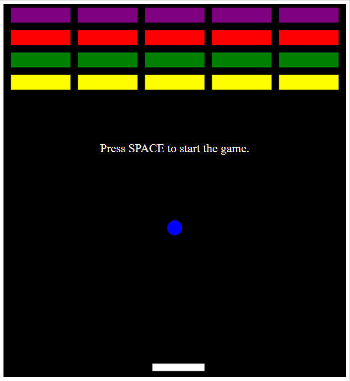

# Brick-Breaker
Brick Breaker game using JavaScript and HTML5 canvas
# About
Use the paddle to bounce the ball and destroy all the bricks. If the ball hits the bottom then the game is over. I made it so the ball always bounces the same regardless of where on the paddle the ball hits. 
# Demo

